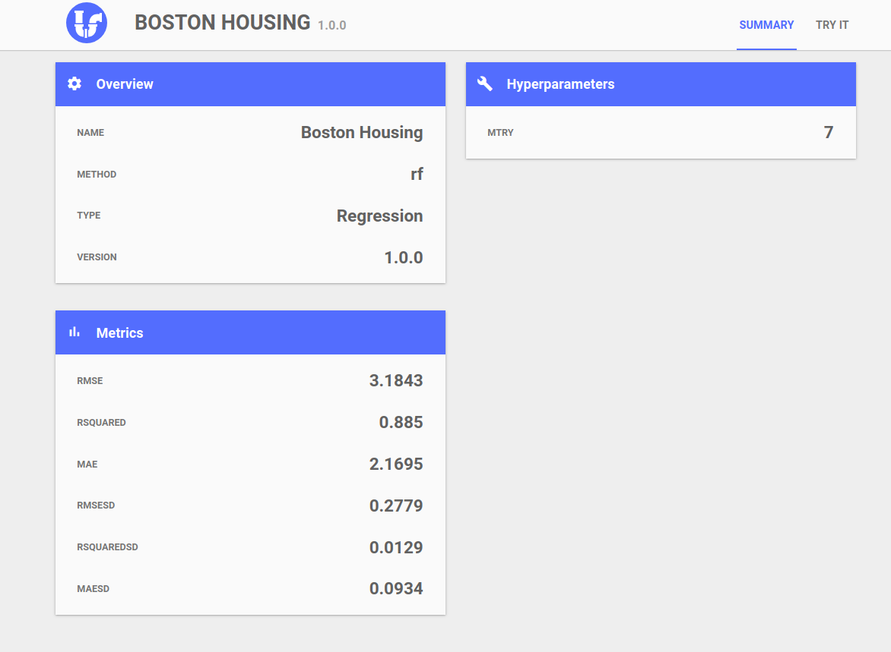

# plumberModel

Package that helps to deploy a trained model to production whit minimal code.
It creates an API using plumber package with several useful endpoints.

```r
library(tidyverse)
library(caret)
library(plumberModel)

model <- train(iris %>% select(-Species), iris$Species)
api <- PlumberModel$new(model)
api$run(port = 8000)
```

## 1. Available endpoints

### `GET` /modelInfo

Returns a JSON with basic information about the model.

```json
{
  "name":["Unnamed model"],
  "method":["rf"],
  "type":["Regression"],
  "version":["1.0.0"],
  "hyperParameters":[{"mtry":2}]
}
```

### `GET` /trainResults

Returns the metrics calculated for the trained model.

```json
[
  {"Metric":"RMSE","Value":0.2799},
  {"Metric":"Rsquared","Value":0.9748},
  {"Metric":"MAE","Value":0.2154},
  {"Metric":"RMSESD","Value":0.0238},
  {"Metric":"RsquaredSD","Value":0.004},
  {"Metric":"MAESD","Value":0.0181}
]
```

### `GET` /inputFeatures

Returns the features of the data used to train the model and some information
about them.

```json
{
  "Sepal.Length":{"class":["numeric"],"mean":[5.8433],"std":[0.6857]},
  "Sepal.Width":{"class":["numeric"],"mean":[3.0573],"std":[0.19]},
  "Petal.Width":{"class":["numeric"],"mean":[1.1993],"std":[0.581]},
  "Species":{"class":["factor"],"levels":["setosa","versicolor","virginica"]}
}
```

### `GET` /predict

Predicts using query params as features. The name of each param must match
with the name of an input variable.

An example query would be:

```url
predict?Sepal.Length=5.0&&Sepal.Width=3.5&&Petal.Width=1.21&&Species=setosa
```

Returns model predictions as a JSON array.

```json
  [2.5505]
```

### `POST` /predict

It has the same behavior as the `GET` version, but uses POST body as input. 

The body must be a JSON with the following structure:

```json
[
  {"Sepal.Length":5.1,"Sepal.Width":3.5,"Petal.Width":0.2,"Species":"setosa"},
  {"Sepal.Length":4.9,"Sepal.Width":3,"Petal.Width":0.2,"Species":"setosa"},
  {"Sepal.Length":4.7,"Sepal.Width":3.2,"Petal.Width":0.2,"Species":"setosa"}
]
```

The response would be:

```json
  [1.4379,1.4549,1.4437]
```

## 2. Adding custom endpoins

PlumberModel objects are [R6 classes](https://cran.r-project.org/web/packages/R6/vignettes/Introduction.html)
that inherits from plumber class.

In order to add custom endpoints one would have to define a subclass.

The following example adds a new '/helloWorld' endpoint:

```r
CustomPlumberModel <- R6Class(
  classname = "CustomPlumberModel",
  inherit = PlumberModel,
  public = list(
    initialize = function(mdl){
      super$initialize(mdl)
      self$handle("GET", "/helloWorld", function(req, res){
        "hello world!"
      })
    }
  )
)
```

You can find more information about plumber and its quirks on 
[plumber documentation](https://www.rplumber.io/docs/programmatic-usage.html#defining-endpoints)

## 3. Add support for custom trained models

By default PlumberModel only supports models trained with caret library. In
order to make it work with custom models it is necessary to implement several
[generic S3 functions](http://adv-r.had.co.nz/S3.html).

The following example would work with a custom model with class 'customModel'

```r

#' Gets basic info about the model.
#' @param mdl Object with class 'customModel'.
#' @return Named list with the custom information about the model
modelInfo.customModel <- function(mdl){
  ...
}

#' Returns a description of each input variable of the model.
#' @param mdl Object with class 'customModel'.
#' @return Named list with the following structure:
#' list(
#'  <var_name_1> = list(class = ["numeric"]), <other_info> = ..., ...),
#'  <var_name_2> = list(class = ["factor"], <levels> = ["lvl1", "lvl2"], ...)
#¡ )
inputFeatures.customModel <- function(mdl){
  ...
}

#' Gets the metrics of the model.
#' @param mdl Object with class 'customModel'.
#' @return Data.frame with the metrics.
trainResults.customModel <- function(mdl){
  ...
}

#' Predicts using the model.
#' @param mdl Object with class 'customModel'.
#' @return Vector with the predictionss
predict.customModel <- function(mdl){
  ...
}

```

## 4. Visualización del estado del modelo

Optionally, you cand build a static web server on top of the API, for monitoring
the model.
You must use the class `PlumberModelWebApp` and access the index url '/'.

```r
library(tidyverse)
library(caret)
library(plumberModel)

modelo <- train(iris %>% select(-Species), iris$Species)
api <- PlumberModelWebApp$new(modelo)
api$run(port = 8000)
```



## 5. Ejemplos

You can find examples in the [examples folder](doc/examples/).